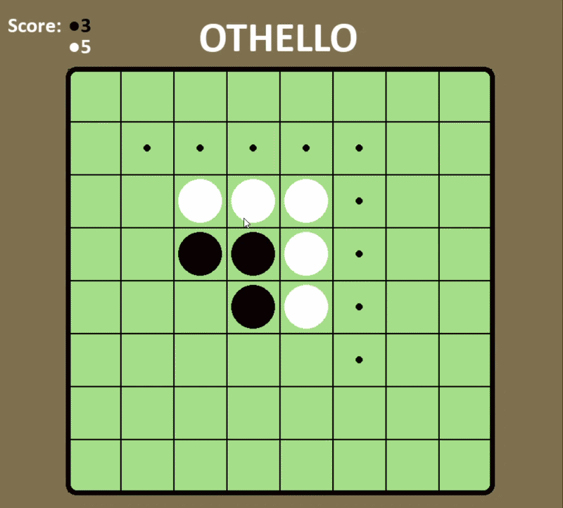

# Othello AI Game ⚪⚫

  

A fully playable Othello (Reversi) game featuring a custom graphical interface and an AI opponent. Built with **Python** and the **Pygame** library.

## AI & Strategy
The project implements a computer opponent designed to challenge the player using different levels of logic:
* **Hard Mode:** Utilizes the **Minimax Algorithm** to evaluate the board state several moves ahead, prioritizing corner control and mobility.
* **Easy Mode:** Uses core strategic logic based on immediate piece count and basic board positioning.

## Features
* **Custom GUI:** An intuitive interface built entirely using Pygame.
* **Two Difficulty Levels:** Switch between different AI behaviors to test your skills.
* **Game Logic:** Full implementation of Othello rules, including valid move validation and automatic disc flipping.
* **Visual Cues:** Highlights available moves to assist the player during their turn.

## Tech Stack
* **Language:** Python 3.x
* **Graphics:** Pygame

## How to run
* **Clone repository:** Clone the project repository on your computer
* **Install modules:** Open a terminal in the directory with the project and run: **pip install -r requirements.txt** 
* **Run main file:** **python -m src.main** 
* **Enjoy playing :)**

